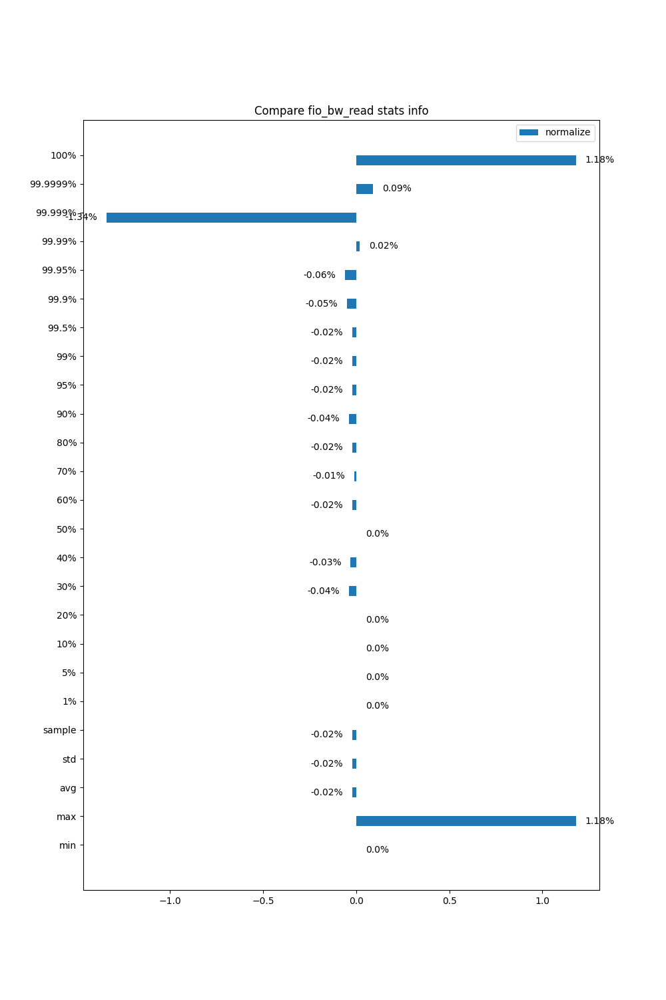

Compare Data
============

.. code-block:: python

    f1 = ['data/USB_Netac_U185/ShortTerm/Step1_DeviceA_NoVibration_Run2']
    f2 = ['data/USB_Netac_U185/ShortTerm/Step1_DeviceA_NoVibration_Run3']
    f3 = 'data/result'
    compare_data(f1, f2, f3, type='fio_lat')
    compare_data(f1, f2, f3, type='fio_bw')

我们首先指定需要进行比较的两批io测试统计数据的路径，然后指定保存比较结果的路径，最后调用compare_data函数进行
指定类别的比较，如读写延迟或者带宽。

.. code-block:: python

    def compare_data(f1, f2, f3, type):
        generate_stats(f1, type)
        generate_stats(f2, type)
        compute_avg_stats(f1, f2, f3, type)
        plot(f3, type, rw='read', normalize=True)
        plot(f3, type, rw='write', normalize=True)

compare_data函数首先生成两批数据的统计信息，如最大、最小、平均的带宽和延迟，5%、10%、 ... 、99%、99.9%、99.99%分位数的带宽和延迟等信息，
然后再生成对应的比较图。由于我vibration的测试进行的比较少，这部分的代码结构比较乱，我就不在此贴上一大堆代码了。

.. code-block:: shell

    python 03_compare_data.py

运行上述命令就可以进行两批io测试的统计数据的比较。

.. code-block:: shell

    min:4.0
    max:82786.0
    avg:5481.08651912032
    std:4059.4672445646247
    sample:2500638.0
    1%:106.0
    5%:415.0
    10%:809.0
    20%:1647.0
    30%:2563.0
    40%:3571.0
    50%:4689.0
    60%:5952.0
    70%:7396.0
    80%:9094.0
    90%:11283.0
    95%:13019.0
    99%:16399.0
    99.5%:17689.0
    99.9%:20323.0
    99.95%:21351.0
    99.99%:23829.0
    99.999%:38352.0
    99.9999%:72751.0
    100%:82786.0

上述文本为读带宽统计信息的一个示例输出。

上图为两批io测试读带宽比较图的一个示例。

